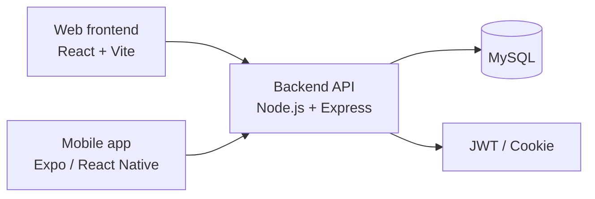

# Course Registration System


> Đồ án xây dựng ứng dụng đăng ký học phần cho sinh viên, có cả web, backend và bản mobile.  
> Repo này mình giữ lại khá đầy đủ phần làm việc thực tế: giao diện, API, tài liệu báo cáo, hình thiết kế và ảnh chụp màn hình.

## 1. Giới thiệu ngắn

Dự án này làm ra để hỗ trợ sinh viên đăng ký học phần, xem thời khóa biểu và theo dõi thông tin học tập. Phía quản trị có thể quản lý môn học, lớp học phần, người dùng và các lượt đăng ký ngay trên hệ thống.

Repo hiện có 3 phần chính:

- `dkhp/`: giao diện web bằng **React + Vite**
- `server/`: backend API bằng **Node.js + Express + MySQL**
- `dkhpmobile/`: bản mobile bằng **Expo / React Native**

## 2. Ảnh demo

<table>
  <tr>
    <td align="center"><br><sub>Màn hình đăng nhập</sub></td>
    <td align="center"><br><sub>Trang quản trị</sub></td>
  </tr>
  <tr>
    <td align="center"><br><sub>Đăng ký học phần trên mobile</sub></td>
    <td align="center"><br><sub>Sơ đồ hệ thống</sub></td>
  </tr>
  <tr>
    <td align="center"><br><sub>Sơ đồ chức năng</sub></td>
    <td align="center"><br><sub>Sơ đồ dữ liệu</sub></td>
  </tr>
</table>

## 3. Nhóm chức năng chính

### Với sinh viên
- Đăng nhập, đăng ký, quên mật khẩu, đổi mật khẩu
- Xem danh sách môn học / học phần đang mở
- Đăng ký, hủy đăng ký học phần
- Xem thời khóa biểu cá nhân
- Xem thông tin cá nhân và lịch sử đăng ký

### Với admin / quản trị
- Quản lý tài khoản người dùng
- Quản lý môn học và lớp học phần
- Quản lý giảng viên
- Theo dõi danh sách đăng ký
- Xem trang tổng quan thống kê

### Với mobile
- Có màn hình đăng nhập, đăng ký
- Có luồng xác nhận email / tạo mật khẩu mới
- Có màn hình xem thời khóa biểu, thông báo và thông tin cá nhân

## 4. Kiến trúc hệ thống

Hệ thống được tách theo kiểu khá đơn giản:



Luồng chính của dự án là:

1. Người dùng thao tác trên web hoặc mobile
2. Frontend gọi API từ backend
3. Backend kiểm tra đăng nhập, phân quyền và xử lý nghiệp vụ
4. Dữ liệu được lưu trong MySQL

## 5. Kết quả thực hiện

Bản hiện tại đã hoàn thành các phần mình thấy quan trọng nhất của đồ án:

| Hạng mục | Trạng thái |
|---|---|
| Đăng nhập / đăng ký | Đã có |
| Quên mật khẩu / đổi mật khẩu | Đã có |
| Quản lý môn học, lớp học phần | Đã có |
| Đăng ký / hủy học phần | Đã có |
| Xem thời khóa biểu | Đã có |
| Giao diện mobile | Có bản chạy thử |
| Tài liệu báo cáo + hình ảnh | Đầy đủ trong `docs/` |

Trong repo chưa có phần benchmark kiểu số liệu hiệu năng lớn, nên mình để README theo hướng mô tả đúng những gì hệ thống đang làm được và những phần đã hoàn thiện.

## 6. Cách chạy dự án

### 6.1. Backend
```bash
cd server
npm install
node app.js
```

### 6.2. Web frontend
```bash
cd dkhp
npm install
npm run dev
```

### 6.3. Mobile
```bash
cd dkhpmobile
npm install
npx expo start
```

## 7. File cấu hình môi trường

Backend đang dùng MySQL và có đọc biến môi trường từ `.env`.

Mình thường để một file `.env.example` như sau:

```env
PORT=3000
CORS_ORIGIN=http://localhost:5173

DB_HOST=127.0.0.1
DB_PORT=3306
DB_USER=root
DB_PASSWORD=your_password
DB_NAME=dkhp

JWT_SECRET=your-secret-key
NODE_ENV=development
```

## 8. Cấu trúc thư mục

```text
Course_regsistration-main/
├── dkhp/                  # Web frontend
├── dkhpmobile/            # Mobile app
├── server/                # Backend API
├── docs/                  # Báo cáo, ảnh, file thiết kế
│   ├── Báo cáo đồ án - nhóm 10.pdf
│   ├── Figma.pdf
│   ├── Testcase.xlsx
│   └── ảnh/
├── thunghiem/             # Bản thử nghiệm
└── thunghiem2/            # Bản thử nghiệm khác
```

## 9. Tech stack

- React
- Vite
- React Router
- Framer Motion
- Node.js
- Express
- MySQL
- JWT
- Axios
- Expo
- React Native
- Lottie

## 10. Tài liệu tham khảo và ảnh

- Ảnh trong README này được lấy từ thư mục `docs/ảnh/` và các file PDF trong `docs/`.
- Báo cáo đồ án: `docs/Báo cáo đồ án - nhóm 10.pdf`
- File layout / wireframe: `docs/Figma.pdf`

## 11. Người thực hiện

**Giảng viên hướng dẫn:** KS. Lê Văn Minh

**Sinh viên thực hiện:**
- Nguyễn Hải Cường — 0174067 — 67CS1
- Lã Minh Khánh — 4004267 — 67CS1
- Trịnh Quỳnh Anh — 0279367 — 67CS1
- Phạm Hồng Thái — 0127067 — 67CS1

## 12. Ghi chú nhỏ

Repo này có giữ lại vài thư mục thử nghiệm và các file cũ trong quá trình làm đồ án, nên có thể nhìn hơi nhiều file một chút. Phần chính để xem nhanh là `dkhp/`, `server/`, `dkhpmobile/` và thư mục `docs/`.

