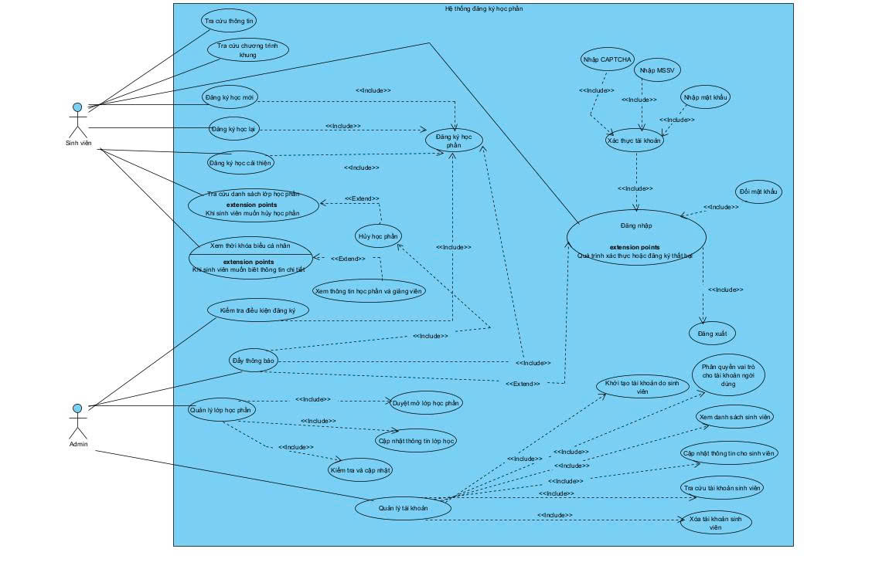
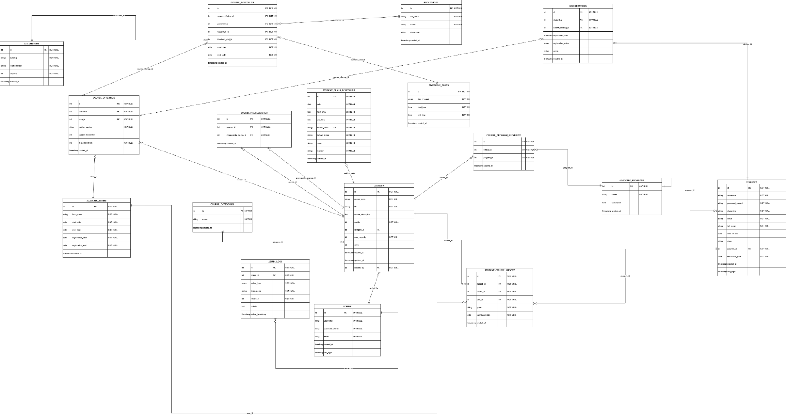
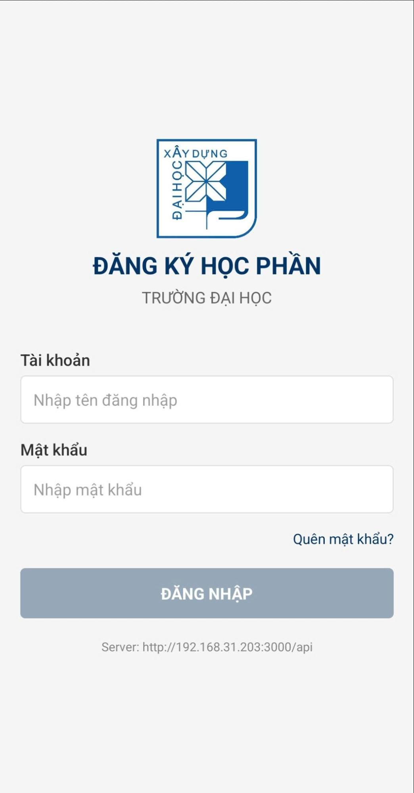

# Hệ Thống Đăng Ký Học Phần HUCE


> **Đề tài:** Xây dựng ứng dụng đăng ký học phần dành cho sinh viên tích hợp xem thời khóa biểu.  
> **Đơn vị:** Trường Đại học Xây dựng Hà Nội (HUCE) – Khoa Công nghệ thông tin – Bộ môn Khoa học máy tính.  
> **Trạng thái:** ✅ Đã hoàn thành báo cáo & prototype  
> **Ngày hoàn thành:** 30/05/2025

---

## Mục lục

- [Tổng quan](#tổng-quan)
- [Tính năng chính](#tính-năng-chính)
- [Công nghệ sử dụng](#công-nghệ-sử-dụng)
- [Cấu trúc repo](#cấu-trúc-repo)
- [Ảnh minh hoạ](#ảnh-minh-hoạ)
- [API chính](#api-chính)
- [Hướng dẫn chạy dự án](#hướng-dẫn-chạy-dự-án)
- [Kiểm thử & tài liệu](#kiểm-thử--tài-liệu)
- [Nhóm thực hiện](#nhóm-thực-hiện)

---

## Tổng quan

Dự án là một hệ thống **đa nền tảng (Web + Mobile)** hỗ trợ sinh viên đăng ký học phần, xem thời khóa biểu, tra cứu chương trình khung và theo dõi thông tin học vụ.  
Phía quản trị viên có giao diện web riêng để quản lý môn học, lớp học phần, tài khoản và dữ liệu đăng ký tập trung.

---

## Tính năng chính

### Dành cho sinh viên
- Đăng nhập, đăng ký, quên mật khẩu, đổi mật khẩu.
- Xem thông tin cá nhân và lịch học theo ngày/tuần.
- Đăng ký, hủy đăng ký, đăng ký hàng loạt.
- Kiểm tra trùng lịch, số chỗ trống, môn tiên quyết và trạng thái học kỳ.
- Xem danh sách môn đã đăng ký, thời khóa biểu, thông tin giảng viên, chương trình khung.

### Dành cho quản trị viên
- Quản lý tài khoản người dùng.
- Quản lý môn học và lớp học phần.
- Quản lý giảng viên.
- Quản lý chương trình khung, học kỳ, dữ liệu đăng ký.
- Xem dashboard/thống kê tổng quan.

### Backend
- REST API tách biệt theo nhóm chức năng.
- Xác thực bằng JWT.
- Phân quyền theo vai trò `admin` / `student`.
- Kết nối MySQL bằng connection pool.
- Có xử lý CORS, cookie, middleware lỗi và test kết nối DB.

---

## Công nghệ sử dụng

**Web Admin**
- React + Vite
- TypeScript
- Axios
- React Router
- Framer Motion

**Mobile App**
- React Native + Expo
- Expo Router
- AsyncStorage
- React Navigation
- Lottie
- Calendar / timetable components

**Backend**
- Node.js
- Express.js
- MySQL / mysql2
- JWT
- bcrypt
- cors
- dotenv
- cookie-parser

**Tài liệu & thiết kế**
- Figma
- PDF báo cáo
- Excel testcase

---

## Cấu trúc repo

```bash
Course_regsistration_doan-main/
├── dkhp/                 # Web admin
├── dkhpmobile/           # Mobile app cho sinh viên
├── server/               # Backend API
├── docs/                 # Báo cáo, Figma, testcase, hình ảnh
├── thunghiem/            # Môi trường thử nghiệm
├── thunghiem2/           # Môi trường thử nghiệm
└── README.md
```

### Các phân hệ chính

- `dkhp/`: giao diện web dành cho quản trị viên.
- `dkhpmobile/`: ứng dụng mobile dành cho sinh viên.
- `server/`: API, middleware, model, route, controller và cấu hình MySQL.
- `docs/`: tài liệu đồ án, bản vẽ Figma, file testcase và ảnh minh hoạ.

---

## Ảnh minh hoạ

### Kiến trúc, ERD và phân rã chức năng







### Giao diện mobile
| Đăng nhập | Đăng ký học phần |
| --- | --- |
|  |  |

### Giao diện web admin


---

## API chính

### Auth
- `POST /api/auth/login`
- `POST /api/auth/register`
- `POST /api/auth/forgot-password`
- `GET /api/auth/profile`
- `POST /api/auth/change-password`
- `POST /api/auth/refresh-token`
- `POST /api/auth/reset-password`

### Courses
- `GET /api/courses`
- `GET /api/courses/search`
- `GET /api/courses/categories`
- `GET /api/courses/available`
- `GET /api/courses/available-by-semester`
- `GET /api/courses/terms`
- `GET /api/courses/curriculum`
- `GET /api/courses/majors`
- `GET /api/courses/:id`
- `GET /api/courses/:id/enrollment`

### Registrations
- `GET /api/registrations/my-registrations`
- `POST /api/registrations/course-signup`
- `POST /api/registrations/batch`
- `POST /api/registrations/batch-drop`
- `GET /api/registrations/my-timetable`

### Students
- `GET /api/students/courses`
- `GET /api/students/my-courses`
- `GET /api/students/schedule`
- `GET /api/students/course-schedule/:registrationId`
- `POST /api/students/register/:courseId`
- `PUT /api/students/drop/:id`
- `GET /api/students/profile`
- `PUT /api/students/profile`
- `GET /api/students/registration-history`

### Admin
- `GET /api/admin/dashboard`
- `GET /api/admin/users`
- `GET /api/admin/courses`
- `GET /api/admin/registrations`

---

## Hướng dẫn chạy dự án

> Mặc định backend sử dụng cổng `3000`.  
> Mobile app đang cấu hình API theo môi trường local trong `dkhpmobile/src/api/config/api-config.tsx`.

### 1) Backend
```bash
cd server
npm install
# sửa file .env nếu cần
node app.js
```

### 2) Web admin
```bash
cd dkhp
npm install
npm run dev
```

### 3) Mobile app
```bash
cd dkhpmobile
npm install
npx expo start
```

---

## Kiểm thử & tài liệu

Trong thư mục `docs/` có sẵn:

- `Báo cáo đồ án - nhóm 10.pdf`
- `Figma.pdf`
- `Testcase.xlsx`

File testcase được chia theo các module:
- Đăng ký học phần
- Quản lý môn học
- Quản lý xác thực
- Quản lý tài khoản
- Thông tin cá nhân
- Chương trình khung

Workbook cũng ghi nhận cả trạng thái `PASS` và `FAIL` để theo dõi các luồng cần hoàn thiện thêm.

---

## Nhóm thực hiện

| STT | Họ và tên | MSSV | Lớp |
| --- | --- | --- | --- |
| 1 | Nguyễn Hải Cường | 0174067 | 67CS1 |
| 2 | Lã Minh Khánh | 4004267 | 67CS1 |
| 3 | Trịnh Quỳnh Anh | 0279367 | 67CS1 |
| 4 | Phạm Hồng Thái | 0127067 | 67CS1 |

**Giảng viên hướng dẫn:** KS. Lê Văn Minh

---

## Ghi chú

- Repo có thêm các thư mục thử nghiệm `thunghiem/` và `thunghiem2/`.
- Nếu deploy lên môi trường khác máy local, cần cập nhật lại URL API trong web/mobile frontend cho đúng IP hoặc domain backend.
