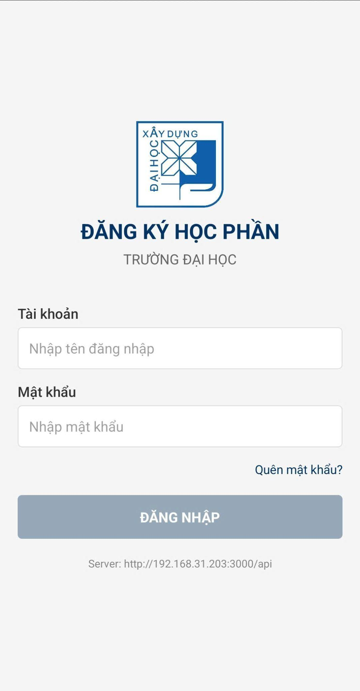
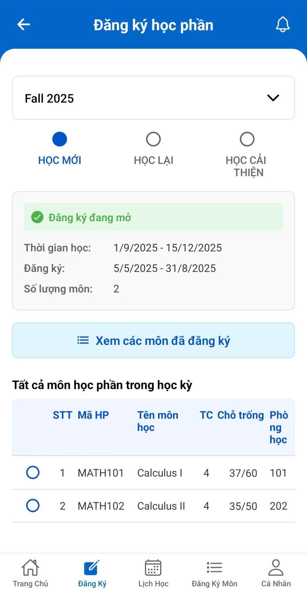
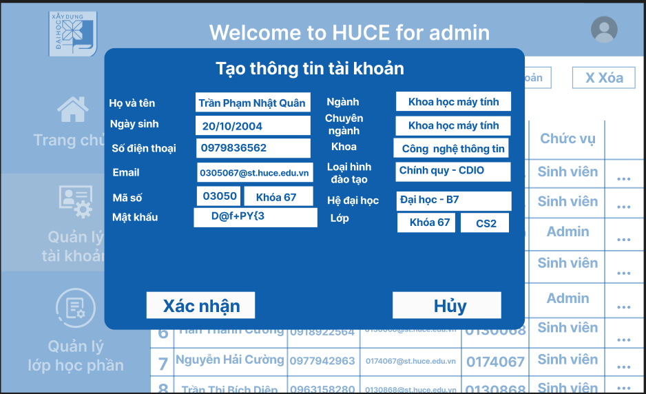
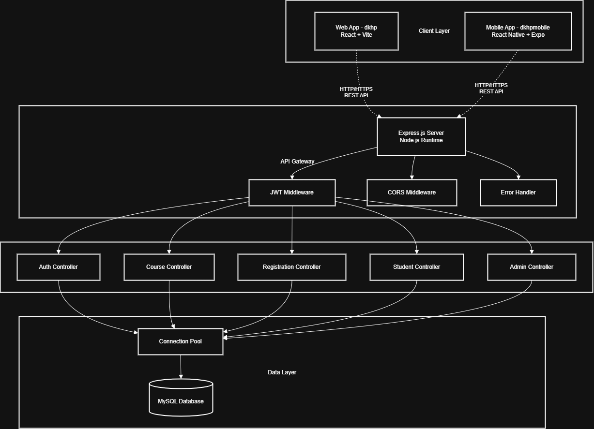
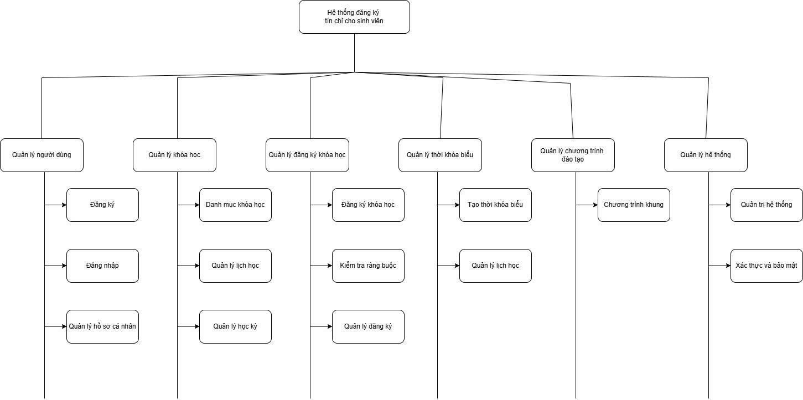
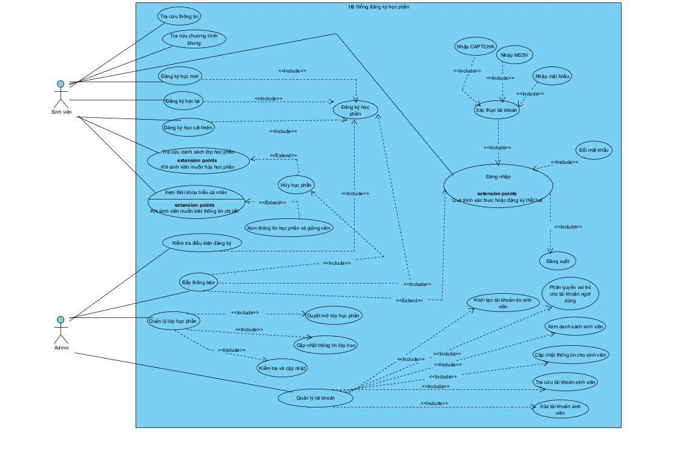
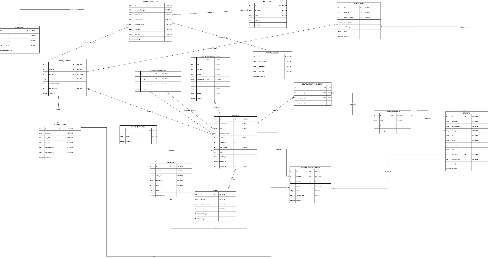

# Xây dựng Ứng dụng Đăng ký Học phần tích hợp Thời khóa biểu cho Sinh viên HUCE

[](./server)
[](./dkhp)
[](./dkhpmobile)
[](./server/src/config)

Chào mọi người! Đây là đồ án môn học **Phát triển ứng dụng đa nền tảng** của nhóm 10 tụi mình (lớp 67CS1, Trường Đại học Xây dựng Hà Nội). Đề tài nhóm lựa chọn là **"Xây dựng ứng dụng đăng ký học phần dành cho sinh viên tích hợp xem thời khóa biểu"**. 

Dự án này sinh ra nhằm giải quyết một vấn đề cực kỳ quen thuộc nhưng cũng đầy nhức nhối của sinh viên HUCE mỗi kỳ đăng ký tín chỉ: giao diện web trường trên điện thoại rất khó thao tác, khó theo dõi lịch học trực quan và dễ bị xung đột lịch học nếu xếp thủ công. Hệ thống của nhóm mình cung cấp ứng dụng di động cho sinh viên đăng ký môn nhanh gọn kèm thời khóa biểu động, đồng thời có trang web admin cho phòng đào tạo dễ dàng quản lý môn học, mở lớp và duyệt danh sách.

---

## 1. Demo Trực Quan (Giao Diện Thực Tế)

Dưới đây là một số hình ảnh thực tế tụi mình chụp lại từ ứng dụng di động (cho sinh viên) và trang web quản trị (cho admin phòng đào tạo) sau khi hoàn thiện:

### Giao diện Mobile App (Sinh viên)
| Màn hình đăng nhập di động | Màn hình đăng ký môn học |
|:---:|:---:|
|  |  |

### Giao diện Web Admin (Quản trị viên)
| Quản lý tài khoản sinh viên | Quản lý danh mục & lớp học phần |
|:---:|:---:|
|  |  |

---

## 2. Quy trình thiết kế UI/UX trên Figma

Trước khi bắt tay vào viết code, nhóm mình đã dành thời gian khảo sát thực tế hành vi đăng ký môn của sinh viên và thiết kế bản vẽ prototype UI/UX hoàn chỉnh trên Figma (chi tiết trong file [Figma.pdf](file:///c:/Users/minhk/Downloads/Course_regsistration/docs/Figma.pdf) gồm 37 màn hình). 

Việc thiết kế trước giúp nhóm tối ưu hóa luồng đi (User Flow):
* **Phía Sinh viên**: Tối giản số bước từ lúc đăng nhập, tìm kiếm môn, kiểm tra kíp học cho đến khi bấm nút đăng ký. Lịch học sau khi đăng ký thành công sẽ tự động đồng bộ vào màn hình Thời khóa biểu dạng lịch tuần/ngày.
* **Phía Quản trị**: Thiết kế bảng biểu trực quan, hỗ trợ xem nhanh số lượng sinh viên đã đăng ký trên mỗi lớp học phần để kịp thời điều chỉnh sĩ số hoặc mở thêm lớp mới.

---

## 3. Kiến trúc Hệ thống & Thiết kế Cơ sở Dữ liệu

### Sơ đồ kiến trúc (System Architecture)
Hệ thống được thiết kế theo mô hình **Client-Server** ba lớp (3-Tier Architecture) giúp phân tách rõ ràng giao diện, logic xử lý và lưu trữ dữ liệu:



* **Client Layer (Tầng ứng dụng khách)**: 
  * App di động cho sinh viên dùng **React Native** + **Expo** + **TypeScript**.
  * Web admin cho cán bộ quản lý dùng **React** + **Vite** + **TypeScript** + **Framer Motion** để tạo hiệu ứng mượt mà.
* **API Gateway / Backend Layer**: Express.js (Node.js) đóng vai trò trung gian xử lý toàn bộ logic nghiệp vụ, xác thực JWT, ghi log và điều phối kết nối.
* **Database Layer**: Sử dụng cơ sở dữ liệu quan hệ **MySQL** để lưu trữ thông tin có tính ràng buộc cao. Kết nối được quản lý thông qua Connection Pool giúp tối ưu hóa hiệu năng khi có nhiều truy cập đồng thời.

---

### Sơ đồ phân rã chức năng & Sơ đồ Use Case
Để xác định rõ các phân hệ nghiệp vụ, tụi mình đã xây dựng sơ đồ phân rã chức năng và sơ đồ Use Case cho từng đối tượng sử dụng (Sinh viên và Quản trị viên):

* **Sơ đồ phân rã chức năng**:
  
* **Sơ đồ Use Case hệ thống**:
  

---

### Thiết kế cơ sở dữ liệu (ERD)
Dữ liệu của hệ thống được tổ chức thành 14 bảng quan hệ chặt chẽ nhằm đảm bảo tính toàn vẹn:



Các bảng chính bao gồm:
* `students` & `academic_programs`: Quản lý sinh viên và chương trình khung của từng ngành học (Quan hệ Một - Nhiều: Một sinh viên chỉ thuộc một ngành, một ngành có nhiều sinh viên).
* `courses` & `course_categories` & `course_prerequisites`: Quản lý môn học, phân loại môn và mối quan hệ tiên quyết (môn A là điều kiện của môn B).
* `academic_terms` & `course_offerings`: Lịch học kỳ và các lớp học phần được mở thực tế trong kỳ đó.
* `course_schedules`, `professors`, `classrooms`, `timetable_slots`: Lịch học chi tiết của từng lớp học phần (học ở phòng nào, thứ mấy, kíp mấy, ai dạy).
* `registrations`: Bảng trung gian lưu vết sinh viên đăng ký lớp học phần (Quan hệ Nhiều - Nhiều giữa sinh viên và lớp học phần).

---

### Thuật toán & Logic cốt lõi

Trong đồ án này, tụi mình tự xây dựng và xử lý các ràng buộc nghiệp vụ ở Backend bằng các câu lệnh SQL và logic JavaScript:
1. **Thuật toán kiểm tra trùng lịch học (Collision Detection)**: 
   Khi sinh viên gửi yêu cầu đăng ký một lớp học phần mới, Backend sẽ truy vấn danh sách các môn sinh viên đã đăng ký thành công trong kỳ đó. Hệ thống sẽ so sánh chéo các cặp giá trị `day_of_week` (Thứ) và `timetable_slot_id` (Kíp học) của lớp học phần mới với danh sách đã có. Nếu phát hiện trùng lặp, API sẽ chặn lại và trả về lỗi: `"Trùng lịch học với môn đã đăng ký"`.
2. **Kiểm tra điều kiện môn tiên quyết (Prerequisite Check)**:
   Trước khi cho phép lưu bản ghi đăng ký, Backend truy vấn bảng `student_course_history` để lấy danh sách các môn sinh viên đã hoàn thành và đạt điểm tích lũy. Sau đó so sánh với bảng `course_prerequisites`. Sinh viên bắt buộc phải pass môn tiên quyết mới được đăng ký môn học tiếp theo.
3. **Quản lý sĩ số thời gian thực**:
   Mỗi lần đăng ký thành công, hệ thống sử dụng Transaction để đồng thời ghi nhận vào bảng `registrations` và tăng biến `current_enrollment` trong bảng `course_offerings` lên 1. Nếu sĩ số đã đạt `max_enrollment`, hệ thống sẽ rollback và báo lỗi hết chỗ.

---

## 4. Kết quả Thực nghiệm & Kiểm thử (QA Report)

Để đánh giá chất lượng phần mềm, nhóm mình đã xây dựng bộ tài liệu kiểm thử chi tiết tại file [Testcase.xlsx](file:///c:/Users/minhk/Downloads/Course_regsistration/docs/Testcase.xlsx). Tụi mình đã thực hiện test thủ công (Manual Testing) trên tổng cộng **69 test cases** phân bổ cho 6 module chức năng chính. 

Dưới đây là bảng thống kê kết quả kiểm thử thực tế của nhóm:

| Module Kiểm Thử | Số lượng Testcases | Đạt (PASS) | Lỗi (FAIL / Bugs tồn đọng) | Tỷ lệ thành công |
| :--- | :---: | :---: | :---: | :---: |
| **Đăng ký học phần** | 20 | 15 | 5 | 75% |
| **Quản lý môn học (Admin)** | 13 | 7 | 6 | 53.8% |
| **Quản lý xác thực (Auth)** | 9 | 9 | 0 | 100% |
| **Quản lý tài khoản (Admin)** | 14 | 12 | 2 | 85.7% |
| **Thông tin cá nhân** | 6 | 6 | 0 | 100% |
| **Chương trình khung** | 11 | 9 | 2 | 81.8% |
| **TỔNG CỘNG** | **73** | **58** | **15** | **79.5%** |

### Một số Bugs thực tế phát hiện được (Nêu thẳng thắn để cải thiện)
Vì thời gian làm đồ án có hạn và năng lực nhóm còn hạn chế, tụi mình xin liệt kê trung thực các lỗi chưa xử lý triệt để được ghi nhận trong file Testcase:
* **Lỗi giới hạn tín chỉ (TC-REG-006)**: Hệ thống chưa chặn được việc sinh viên đăng ký vượt quá 20 tín chỉ tối đa trong học kỳ hiện tại (vẫn cho đăng ký thành công).
* **Lỗi phân quyền email Admin (TC-CRS-002)**: Khi tạo tài khoản Admin mới, form validation trên web vẫn bắt buộc email phải có đuôi `@st.huce.edu.vn` (đây vốn là đuôi email của sinh viên), dẫn tới không tạo được tài khoản admin từ giao diện.
* **Lỗi cập nhật mã môn (TC-CRS-007)**: Khi admin sửa thông tin môn học, hệ thống chỉ cập nhật tên môn mà không cập nhật được mã môn học xuống database MySQL.
* **Lỗi xử lý mất mạng đột ngột (TC-CRS-011)**: Khi người dùng bấm xóa/cập nhật môn học trong lúc không có mạng, ứng dụng React Native vẫn cập nhật giao diện local tạm thời (gây nhầm lẫn đã xóa thành công) nhưng thực tế request lên database bị lỗi và dữ liệu vẫn còn nguyên.

---

## 5. Khả năng Tái tạo & Triển khai (Local Setup)

Dưới đây là các bước để chạy thử toàn bộ hệ thống này trên máy local của mọi người:

### Yêu cầu môi trường
* Đã cài đặt **Node.js** (Khuyến nghị bản LTS 18 hoặc 20 trở lên)
* Đã cài đặt và khởi động dịch vụ **MySQL Server** (Port mặc định: 3306)

---

### Bước 1: Thiết lập Cơ sở dữ liệu (MySQL)
1. Mở MySQL Workbench hoặc một công cụ quản lý DB (như DBeaver, Navicat...).
2. Tạo một database mới tên là `dkhp`:
   ```sql
   CREATE DATABASE dkhp CHARACTER SET utf8mb4 COLLATE utf8mb4_unicode_ci;
   ```
3. (Tùy chọn) Dự án sử dụng cơ chế đồng bộ hoặc chạy script tạo bảng. Hãy chắc chắn cấu hình đúng tài khoản MySQL trong file cấu hình.

---

### Bước 2: Chạy Backend Server
1. Truy cập vào thư mục `server`:
   ```bash
   cd server
   ```
2. Tạo file `.env` dựa theo file mẫu `.env` có sẵn và sửa lại thông số kết nối MySQL của bạn:
   ```env
   DB_HOST=127.0.0.1
   DB_USER=root
   DB_PASSWORD=mật_khẩu_mysql_của_bạn
   DB_NAME=dkhp
   DB_HOST_PORT=3306
   DB_DIALECT=mysql
   PORT=3000
   ```
3. Cài đặt các thư viện phụ thuộc:
   ```bash
   npm install
   ```
4. Khởi động server ở chế độ phát triển:
   ```bash
   npm run dev
   ```
   Nếu màn hình hiện dòng chữ `Database connection established successfully!` và `Server is running on port 3000` là Backend đã kết nối DB thành công.

---

### Bước 3: Chạy Web Admin (React + Vite)
1. Mở một terminal mới và truy cập vào thư mục `dkhp`:
   ```bash
   cd dkhp
   ```
2. Cài đặt dependencies:
   ```bash
   npm install
   ```
3. Chạy dev server:
   ```bash
   npm run dev
   ```
4. Truy cập giao diện admin qua đường dẫn local hiển thị trên terminal (thường là `http://localhost:5173`).

---

### Bước 4: Chạy Mobile App (React Native + Expo)
1. Mở một terminal mới và truy cập vào thư mục `dkhpmobile`:
   ```bash
   cd dkhpmobile
   ```
2. Cài đặt dependencies:
   ```bash
   npm install
   ```
3. Khởi chạy Expo:
   ```bash
   npx expo start
   ```
4. Quét mã QR bằng ứng dụng **Expo Go** trên điện thoại (Android) hoặc Camera mặc định (iOS) để xem và trải nghiệm app di động trực tiếp. (Lưu ý: Điện thoại và máy tính chạy server phải kết nối chung một mạng Wi-Fi).

---

## 6. Cấu trúc Thư mục Dự Án

Cấu trúc mã nguồn của tụi mình được tổ chức như sau:

```text
Course_regsistration/
├── server/                     # Backend API (Node.js & Express)
│   ├── src/
│   │   ├── config/             # Cấu hình kết nối MySQL
│   │   ├── controllers/        # Logic xử lý API (Đăng ký, môn học, tài khoản)
│   │   ├── middleware/         # Xác thực JWT, phân quyền admin/student
│   │   ├── models/             # Định nghĩa cấu trúc bảng (TypeORM/Entity Schema)
│   │   ├── routes/             # Định tuyến API endpoints
│   │   └── services/           # Nghiệp vụ bổ trợ cho admin/student
│   ├── app.js                  # Điểm khởi chạy Backend chính
│   └── package.json
│
├── dkhp/                       # Giao diện Web Admin (React & Vite)
│   ├── src/
│   │   ├── components/         # Các component UI dùng chung
│   │   ├── pages/              # Các trang quản trị (Môn học, Tài khoản, Học kỳ)
│   │   └── App.jsx             # Cấu hình Router & State chính
│   ├── package.json
│   └── index.html
│
├── dkhpmobile/                 # Giao diện Mobile App cho Sinh viên (Expo & React Native)
│   ├── app/                    # Expo Router (Cấu hình luồng trang di động)
│   ├── screens/                # Màn hình chính (Đăng nhập, Đăng ký môn, Lịch học)
│   ├── navigation/             # Cấu hình thanh điều hướng Bottom Tab
│   ├── assets/                 # Icon, hình ảnh tĩnh, fonts sử dụng trong app
│   └── package.json
│
└── docs/                       # Tài liệu đồ án chính thức
    ├── images/                 # Ảnh chụp màn hình & sơ đồ trích xuất phục vụ README
    ├── Báo cáo đồ án - nhóm 10.pdf
    ├── Figma.pdf               # File xuất thiết kế 37 màn hình prototype
    └── Testcase.xlsx           # File thống kê 73 kịch bản kiểm thử
```

---

## 7. Công Nghệ Sử Dụng & Lời Cảm Ơn

### Tech Stack
* **Frontend Web (Admin)**: React 19, TypeScript, Vite, Framer Motion (hiệu ứng chuyển trang), Axios (gọi API).
* **Frontend Mobile (Sinh viên)**: React Native, Expo 52, TypeScript, React Navigation, AsyncStorage (lưu token local), Lottie React Native (hiệu ứng loading).
* **Backend API**: Node.js, Express.js, MySQL (thông qua MySQL2 connection pool), JWT (xác thực token), bcrypt (mã hóa mật khẩu).
* **Công cụ hỗ trợ**: GitHub (quản lý phiên bản), VS Code (viết code), Figma (thiết kế UI/UX).

### Lời Cảm Ơn
Để hoàn thiện được đồ án này, nhóm 10 tụi mình xin gửi lời cảm ơn chân thành và sâu sắc nhất tới **thầy KS. Lê Văn Minh** - Giảng viên bộ môn Khoa học Máy tính, Khoa Công nghệ Thông tin, Trường Đại học Xây dựng Hà Nội. Thầy đã tận tình hướng dẫn, định hướng kỹ thuật và đưa ra những lời khuyên cực kỳ thực tế trong suốt quá trình nhóm mình triển khai đề tài môn học này. 

Nhóm tụi mình cũng xin cảm ơn các bạn bè cùng lớp đã hỗ trợ trao đổi tài liệu và góp ý để ứng dụng ngày một hoàn thiện hơn. Dù đã nỗ lực hết mình nhưng đồ án chắc chắn vẫn còn nhiều thiếu sót, tụi mình rất mong nhận được thêm các ý kiến đóng góp từ thầy cô và mọi người!

### Thành viên nhóm thực hiện (Nhóm 10 - Lớp 67CS1):
* **Nguyễn Hải Cường** (MSSV: 0174067)
* **Lã Minh Khánh** (MSSV: 4004267)
* **Trịnh Quỳnh Anh** (MSSV: 0279367)
* **Phạm Hồng Thái** (MSSV: 0127067)
